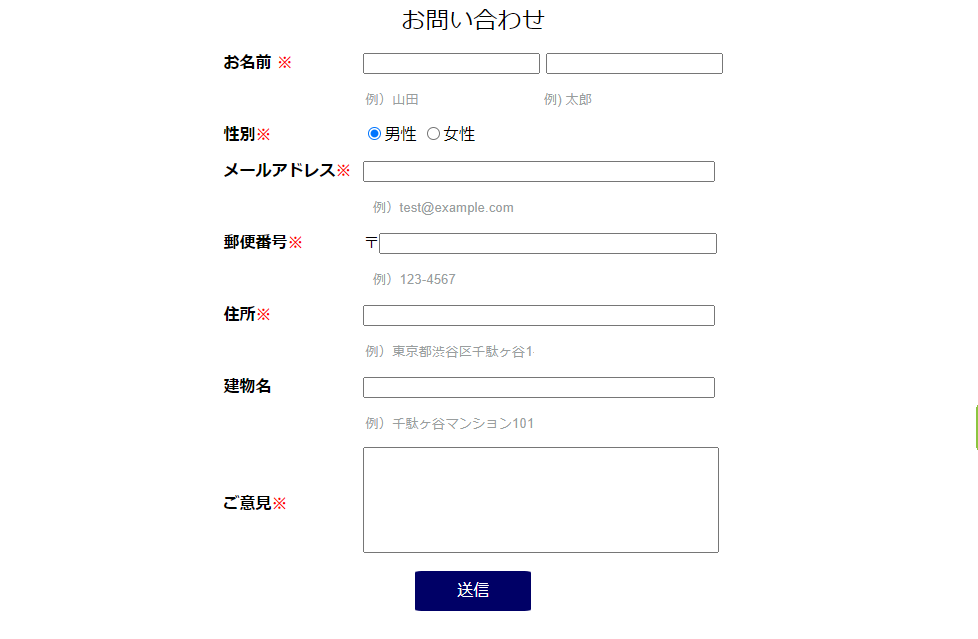
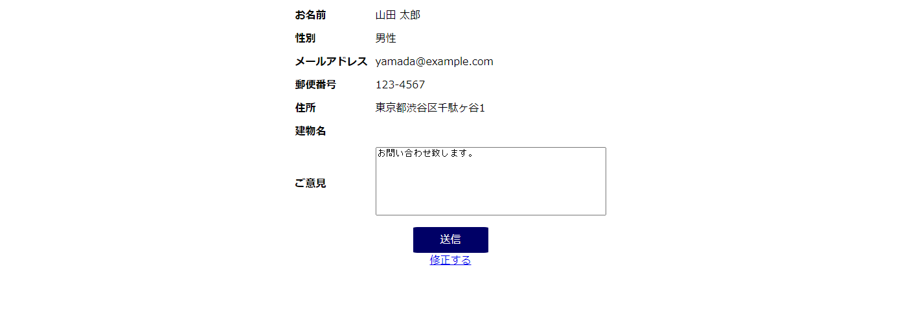
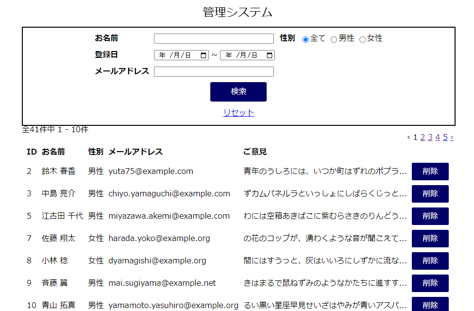
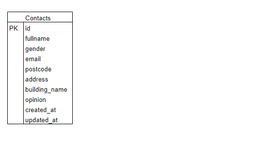

# アプリケーション名
お問い合わせ管理アプリ

  

  

  

## 作成した目的
サービスに対するお問い合わせとその管理

## アプリケーションURL
http://127.0.0.1:8000/
 問い合わせ申し込みフォーム
 
http://127.0.0.1:8000/admin
 問い合わせ管理フォーム

## 機能一覧
・お問い合わせ入力

    ・お問い合わせ確認
        ・入力内容の自動チェック
            ・必須項目の入力チェック
            ・メールアドレスの形式チェック
            ・郵便番号、全角文字の際は自動半角変換
            ・住所　郵便番号より検索
            ・ご意見　１２０文字チェック

・お問い合わせ修正

    ・お問い合わせ内容確認
        ・修正のためブラウザーバック（入力データ保持）

・お問い合わせデータ管理

    ・一覧
    ・検索（名前・期間・メールアドレス）
    ・削除

## 使用技術（実行環境）
Laravel　8.83.24

## テーブル設計

contactsテーブル

    id:bigint unsigned PRIMARY KEY
    fullname:varchar(255) NOT NULL
    gender:tinyint NOT NULL (1:男性 2:女性)
    email:varchar(255) NOT NULL
    postcode:char(8) NOT NULL
    address:varchar(255) NOT NULL
    building_name:varchar(255)
    opinion:text NOT NULL
    created_at:timestamp
    updated_at:timestamp

	

## ER図

  

## 他に記載することがあれば記述する

